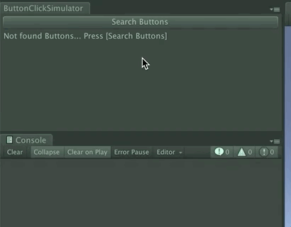

# ButtonClickSimulator
Unity button click simulator

# Demo

# How to use
`MenuItem [Window/ButtonClickSimulator]`
or
`ButtonClickSimulator.Open()`

# Feature
Simualte click event of any buttons in same frame.
